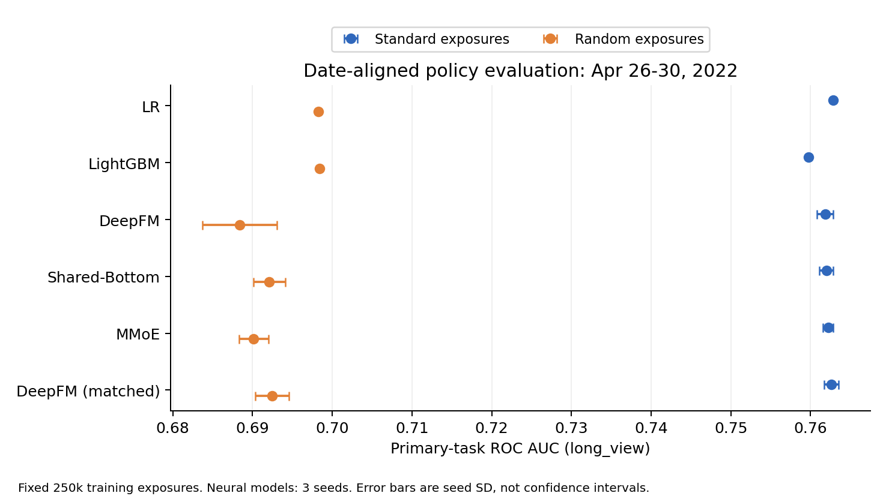
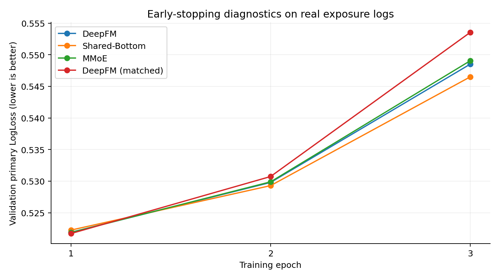
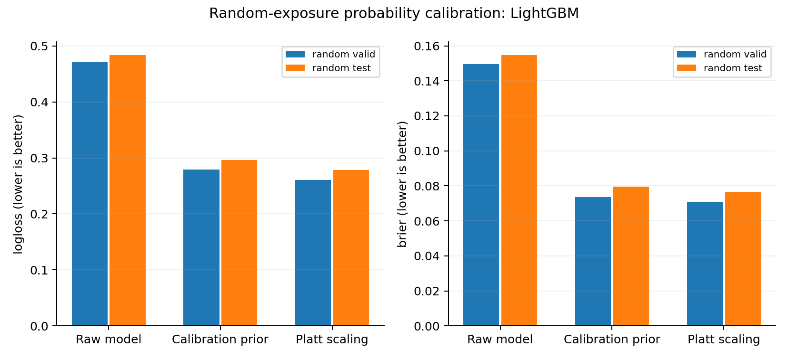

# KuaiRank Lab 实验报告

## 实验规模和协议

本项目独立实现短视频长播预测的精排模型及候选评分服务，使用官方 KuaiRand-Pure，共 **2,622,668 条曝光、27,285 个用户、7,583 个视频**。它适合推荐算法与广告排序岗位展示特征、训练、评估和推理能力，当前没有搜索或召回链路。

普通曝光训练池 1,141,300 条，所有模型固定抽取同一批 250,000 条训练。完整普通验证集 161,956 条、测试集 133,353 条；随机曝光校准集 163,771 条、验证集 237,288 条、测试集 785,000 条。未用随机曝光标签训练基础模型。

8 个类别特征、19 个数值特征；用户/视频/作者历史按前日快照生成，只累计普通曝光。排除整月视频统计及无可靠快照时间的用户画像。采用全局时间切分、训练样本拟合词表、验证主任务 LogLoss 早停，测试前保存模型选择和产物指纹。训练过程中未访问测试标签。数据 manifest 和逐行预测均保存 SHA256。

保留了审计中的 23,479 条“所选日志列投影重复”。这不证明原始完整事件完全重复，缺少事件唯一键时未直接删除。零时长记录 65,794 条，数值处理避免除零；基础视频元数据连接缺失为 0。

## 主任务结果

LR、LightGBM 各 1 个 seed；四种神经模型各 3 个 seed，共 14 个运行。下表神经模型为平均值；详细标准差、辅助任务和分桶结果见 [自动报告](../results/comparison.html) 及各运行 `metrics.json`。

| 模型 | 验证 AUC | 验证 LogLoss | 普通测试 AUC | 普通测试 LogLoss | 随机测试 AUC |
| --- | ---: | ---: | ---: | ---: | ---: |
| LR | 0.763998 | 0.521614 | 0.751415 | 0.534264 | 0.686956 |
| LightGBM | 0.760542 | 0.524878 | 0.748552 | 0.535849 | 0.685885 |
| DeepFM | 0.762687 | 0.521898 | 0.751219 | 0.531535 | 0.677269 |
| Shared-Bottom | 0.762789 | 0.522249 | 0.751628 | 0.531667 | 0.680262 |
| MMoE | 0.763065 | 0.521871 | 0.752131 | 0.531163 | 0.678182 |
| DeepFM 容量匹配 | 0.763523 | 0.521704 | 0.752202 | 0.531574 | 0.680577 |

**验证集选择 LR，冻结后不按测试集重选。** MMoE 在普通测试集的平均 LogLoss 较低，这只作为已冻结模型的描述性结果。不能据此回头宣布它是预先选出的最优模型。神经模型均在第 1 epoch 达到最好的验证主任务 LogLoss，随后过拟合；当前只验证一组超参数，不能推断这些架构总体不如 LR。

DeepFM 参数量 512,899，MMoE 657,225，容量匹配 DeepFM 657,301，误差约 0.012%。容量匹配用于区分参数量增加与任务共享的影响。

用户级 paired bootstrap（2,000 次）比较相同 seed 的 MMoE 与 DeepFM：三个 seed 的验证 LogLoss 差值分别为 -0.000985、+0.000132、+0.000772；与容量匹配 DeepFM 比较分别为 +0.000658、-0.000555、+0.000398。负值表示 MMoE 更好。收益方向并不稳定，不支持“MMoE 稳定提升”的结论。区间仅描述一个固定模型对的用户采样不确定性，训练 seed 波动需另外报告。完整区间见 [跨 seed 对照](../results/multiseed_paired_bootstrap.json)。

普通与随机曝光的 AUC 明显不同。日期对齐只能排除部分时间差异，用户、视频、UI 和正例率仍不同，因此不把 AUC 差直接解释为曝光偏差的因果效应。

## 随机曝光概率校准

LightGBM 的 logit 分数经独立 calibration 切分拟合 Platt 斜率和截距。基础模型已冻结，校准没有使用随机验证或测试标签。额外加入只预测 calibration 集正例率的常数基线，区分正例率修正与分数的辨别能力。

| 随机曝光测试 | AUC | LogLoss | Brier | ECE |
| --- | ---: | ---: | ---: | ---: |
| 原始 LightGBM | 0.685885 | 0.483306 | 0.154609 | 0.262085 |
| calibration 正例率常数 | 0.500000 | 0.296011 | 0.079559 | 0.005371 |
| Platt 校准 | 0.685885 | 0.278728 | 0.076711 | 0.004975 |

校准后 LogLoss 相对原始模型降低 **42.33%**，相对正例率常数降低 **5.84%**。这是目标流量有监督概率校准收益；正斜率不改变排序或 AUC。常数基线 ECE 也很低，故仅展示 ECE 改善不足以说明模型有用。这不是 IPS、因果去偏或在线收益。

## 排序指标的陷阱

普通验证集有 82,801 个 user-day，54.64% 只有一条曝光。LR 的原始日志集合 NDCG@10 为 0.9196，但在至少 5 条曝光且同时含正负反馈的 3,751 个组上为 **0.7681**。这些都只是已曝光集合内排序，不代表全库推荐质量。项目报告分类、GAUC 和非平凡曝光集合排序三种视角，避免用虚高的短列表 NDCG 充当主要成果。

## 服务与验证

FastAPI 加载真实训练编码器与模型，支持批量候选长播评分、严格输入检查及未知类别诊断。优化小批次类别编码，避免每次请求为完整词表构造映射对象；与批量编码路径的语义一致性有测试覆盖。

真实 24 候选请求的 HTTP 输出与离线概率最大绝对差为 **0**。本机 CPU、单进程、4 并发、20 次预热、300 次固定请求的测量：46.48 QPS，HTTP p50/p95/p99 = 82.54/123.29/140.34 ms，编码诊断及模型评分 p95 = 30.34 ms。存在本机其他工作负载，且重复固定请求，不能外推生产吞吐；不含召回、特征存储和网络部署耗时。记录见 [压测 JSON](../results/serving_benchmark_final.json)。

首轮 **20 项本地测试通过**，覆盖前日历史隔离、随机流量不更新历史、时间边界、泄漏特征拒绝、训练词表 OOV、FM 数值、模型梯度、分组指标边界、产物指纹、离线/推理一致性和 API 输入校验。2026-10-09 增加未知类别优化器更新与实际文件指纹测试后，**28 项通过**。仓库包含 CI 配置，尚未在远程 GitHub 执行。

## 可复现性与后续工作

数据及模型文件保留在本机，Git 仅保留代码、配置、JSON/HTML 指标和图表；克隆后需下载并训练。命令见根目录 README。原始训练源码保存在首个 Git 提交，后续小批次编码优化仅改善推理路径，测试保证输出相同。

当前结论限于候选池历史、固定 25 万训练曝光和这组超参数。历史特征消融已在 2026-10-09 完成，只访问验证标签，结果及产物核验见 [GitHub 对照与改进记录](github_review.md)。任务权重消融、全量训练、PLE、KuaiRand-1K 双塔召回和在线特征服务仍为下一阶段工作。项目的数据及离线实验已经实际跑通；简历只填写自己理解并能解释的部分。
