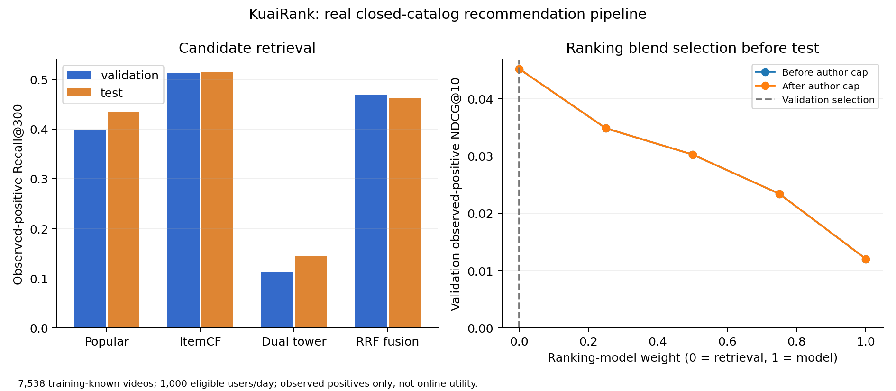

# 完整推荐链路：实测结果与结论

## 评估对象

7,538 个训练期已经出现的视频。验证日期 2022-04-22，测试日期 2022-05-01；在每个日期具有池内、未在此前普通日志曝光过的长播正例的用户中，固定抽取 1,000 人。候选覆盖与用户选择均保存审计。

验证日有 5,069 个符合条件的用户、6,943 个可评估正例用户视频对；原始正例 7,052 对，排除普通历史已看 108 对、池外 1 对。测试日有 4,514 个符合条件的用户、6,497 对可评估正例；原始正例 6,580 对，排除已看 83 对，池外 0 对。抽样前后的统计分开报告，不把有命中的用户当作全部用户。

双塔使用 10 万去重长播对训练 5 个 epoch，32 维 ID embedding 与独立 MLP，两边归一化。批次内对同一用户的所有已知长播视频采用多正例目标，避免已知正例成为假负例。单个初始化 seed=2026，不声称多 seed 稳定优势。模型已真实训练并保存。

索引构建前 FAISS 下载曾未完成，训练和 ItemCF 权重已保存；恢复流程复用这些权重，训练曲线逐字恢复自日志，无法恢复训练耗时，JSON 将其标为 null，而不是虚构耗时。

## 冻结测试结果

默认路由由验证 Recall@300 选择，测试只作报告。

| 召回方式 | 测试 Recall@300 | 测试 Hit@300 | 测试 NDCG@10（原召回顺序） |
| --- | ---: | ---: | ---: |
| 热门 | 0.434957 | 0.518 | 0.038057 |
| ItemCF | **0.514496** | **0.593** | **0.058649** |
| ID 双塔 + HNSW | 0.144744 | 0.193 | 0.006548 |
| 三路 RRF 融合 | 0.461502 | 0.542 | 0.044224 |

ItemCF 相比热门 Recall@300 高 **7.95 个百分点**。这是一组固定用户样本、固定配置的观测正例结果，不是在线提升或所有视频真实相关性的完整判断。

## 为什么默认模型排序权重是 0

对于验证集选中的 ItemCF 候选，比较模型排序权重 0、0.25、0.5、0.75、1，验证 NDCG@10 分别为 **0.045217、0.034839、0.030257、0.023406、0.012024**。因此冻结选择 0，保留召回顺序。模型仍计算并返回长播分数，作为可检查的诊断结果；不能宣称默认推荐顺序由 LR 改善。

原精排模型在已曝光样本上有较好的分类表现，不代表它能对整个召回候选池有效重排。召回候选与训练曝光分布不同，且该 benchmark 只知道已观测长播正例，未曝光结果未知。因此，这个负结果既提醒目标和样本分布不匹配，也不能证明 LR 在真实线上一定更差。

同一作者最多 2 条的约束已实现并通过人工构造的冲突测试。在本次测试用户上，约束前后 NDCG@10 相同，未观察到该规则对汇总指标的影响。最终推荐覆盖 860 个视频、814 个作者，视频池覆盖 11.41%。不能把“规则存在”写成多样性实测提升。

## ANN 与推荐效果分别看

200 个用户查询、Top100 邻居，HNSW 与 Flat 精确向量邻居的平均重合率 **96.22%**。这说明近似索引保留了大部分向量邻居，不说明双塔推荐效果好。

批量 200 查询本机测量：Flat 92.70 ms，HNSW 78.73 ms。视频池仅 7,538 个，不能把这个结果外推到亿级视频库或宣称显著生产加速。直接指标见 `results/end_to_end.json`。

## 服务与可复现边界

`POST /recommend` 接收用户 ID，执行召回、普通历史已看过滤、特征、评分、排序融合与作者约束。页面提供默认策略及三路召回切换。日期不符的请求被拒绝，无历史用户使用热门兜底，所有产物启动前校验。

离线 1,000 用户测试的完整调用耗时 p50/p95/p99 = **72.67/180.43/283.11 ms**，不等同于 HTTP 往返。HTTP 混合用户压测另存 `results/recommendation_benchmark.json`，包括冷启动、重复项、作者上限、过期快照及离线/HTTP 一致性检查。

本地 **37 项测试通过**，包含原始精排数据协议和新增真实代码的完整推荐路径测试。GitHub CI 安装可选 FAISS 依赖后运行同一套测试。

数据、模型、快照和索引留在本机，不提交 Git；新机器需按 README 下载数据、训练精排，再构建召回与快照。服务是历史数据演示，不含生产实时日志接入、外部特征库和线上 A/B。Pure 的历史只覆盖候选池，已看过滤只覆盖普通日志；这些边界会影响解释。

原精排报告已经使用过相同测试日期，这次是扩展任务的一次性冻结报告，不能包装成新的盲测数据。测试之后没有修改召回模型、路由或排序权重。

完整原始数值：[端到端 JSON](../results/end_to_end.json)、[冻结清单](../results/end_to_end_freeze.json)、[双塔曲线](../results/retrieval_training.json)。讲解见 [从一条请求理解项目](walkthrough.md)。
