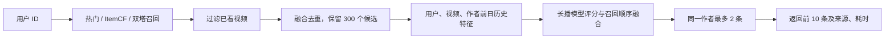

# 从一条请求讲清楚 KuaiRank

## 项目到底解决什么

用户打开推荐页时，系统需要从很多视频中选出少量视频，并决定展示顺序。本项目使用真实短视频日志，完成“召回 → 过滤融合 → 特征生成 → 精排 → 多样性”的可运行链路。

这里的完整是指公开数据上的端到端推荐项目：有训练、有产物、有评估、有服务和演示页面。视频池是 KuaiRand-Pure 中训练期已经观察到的 7,538 个视频，不是快手全平台内容；服务使用历史时点快照，不是假装有实时线上用户。

## 第一步：为什么先召回

如果每次请求都对所有视频执行复杂评分，视频库越大，开销越大。召回先用更便宜的办法筛选可能有兴趣的候选，再交给精排。

本项目比较三路召回：

| 方式 | 怎样找视频 | 优点与限制 |
| --- | --- | --- |
| 热门 | 按快照前的长播次数排序 | 简单稳健，未知用户也能用，个性化弱 |
| ItemCF | 看过 A 的人还长播了哪些视频 | 利用共同兴趣，需要足够历史，容易偏向热门 |
| 双塔 | 学习用户向量和视频向量，找相近视频 | 可预计算视频向量并建索引，需要真实泛化评估 |

ItemCF 将用户与视频的长播关系去重，形成稀疏矩阵。视频之间用共同长播用户的余弦相似度连接，每个视频最多保留 80 个邻居，分块计算以控制内存。用户已有的长播视频投票给相似视频。

双塔有两个独立网络：用户 ID 经过 embedding 和 MLP 得到 32 维向量，视频 ID 经过另一套 embedding 和 MLP 得到 32 维向量，两边做 L2 归一化。训练让长播用户与视频的向量更接近。

一批正例中的其他视频可作为对照，但不能把用户已知喜欢的其他视频错当负例。代码使用 multi-positive loss：同一用户在批次中的所有已知长播视频都进入正例集合，包括重复视频 ID。这是 ID 双塔基线，没有声称使用视频图像、文本或完整序列。

FAISS 将视频向量建成 HNSW 近似索引，同时保留 Flat 精确索引作参照。**索引邻居一致率**回答“近似检索有没有损失向量邻居”，**推荐 Recall@K**回答“有没有找回未来观测到的长播视频”，两者不能混为一个指标。

## 第二步：过滤、去重与融合

请求日前普通日志中已曝光的视频会被过滤，避免同一视频重复推荐。过滤依据是当前快照的历史，不能查看今天或未来才发生的事件。

三路候选可按 Reciprocal Rank Fusion 融合：每条召回列表按排名贡献 `1 / (60 + rank)`，合并同一视频的贡献。这样不需要把“长播次数”“ItemCF 相似度”“向量内积”强行当作同尺度分数比较。

融合不必然赢过单路。默认路由由验证集 Recall@300 在热门、ItemCF、双塔和融合之间选择。未知训练用户或缺少长播历史时，向量召回使用热门兜底。响应保留来源，能追踪一个视频为什么进入候选。

## 第三步：系统自行生成特征

原来的 `/rank` 接口要求调用者提供全部特征；现在 `/recommend` 只接收用户 ID、条数和可选场景字段，服务自己读取快照。

快照在 UTC+8 每日零点冻结。用户、视频、作者的曝光次数和长播/点击/点赞率，只使用此前普通流量日志。行为率用固定先验平滑，数据少时避免极端的 0% 或 100%。随机曝光不更新这些历史统计。

视频时长使用此前普通日志中已观测时长的中位数，宽高、作者、标签使用基础元数据；不会用今天真实观看后才知道的行为。它与原精排训练的逐事件时长存在输入差异，报告保留这个限制。

请求时间必须落在快照当天，跨日请求被拒绝，防止悄悄使用过期特征。演示未提供请求时间时，使用历史快照当天中午。真实部署需按日构建新快照，接入可追溯的数据源。

## 第四步：精排为什么还要和召回顺序融合

精排模型计算候选视频的长播分数。原实验比较 LR、LightGBM、DeepFM、Shared-Bottom、MMoE 和容量匹配单任务模型，验证集选出的基础精排模型是 LR。

训练精排的样本是“平台实际曝光的视频”，召回拿来的候选可能从未向该用户曝光，两者分布不同。因此模型计算了概率分数，也不代表模型分数排序一定优于召回顺序。

本项目在验证集比较五个融合权重：0、0.25、0.5、0.75、1。0 只用召回顺序，1 只用模型顺序，中间按两种排名的归一化位置融合。根据带作者约束的验证 NDCG@10 选权重，然后冻结用于测试。若最终选择 0，必须诚实解释：模型被实现和评估，但没有被当前离线目标证明有增益。

## 第五步：控制作者多样性

执行时还有一个等价优化：默认权重为 0，不需要用模型分数排序，因此可先按召回顺序选出符合作者约束的结果，再只对返回视频打分。完整模型重排模式仍对全部候选评分。结果不会因这项优化改变，响应另列实际评分条数及未知类别统计范围。

从排好的候选中依次取视频，同一个作者最多 2 条。作者不足时宁可少返回，也不突破规则。

这个规则可能让相关性指标下降，却减少推荐列表被一个作者占满。报告分别展示施加规则前后指标，不把规则本身称作模型效果提升。

## 怎样知道做得好不好

项目保留两套互补评估：

- **曝光分类评估**：针对真正曝光的样本，计算长播 AUC、用户 GAUC、LogLoss 和概率校准。原来的 14 个模型运行属于这一套。
- **端到端推荐评估**：在固定视频池内，过滤历史已看视频，检查未来一天观测到的长播视频能否被找回、排进前 10。召回看 Recall@300，输出排序看 Recall/Hit/NDCG@10。

端到端验证使用 2022-04-22，测试使用 2022-05-01，分别从满足条件的用户中固定抽取最多 1,000 人。用户集合、重复正例过滤、池外视频比例均记录。不仅展示成功找回的用户，也保留推荐未命中的用户。

**未曝光视频的反馈未知。** 指标只根据已观测长播正例判断，不能证明其他推荐视频不相关，也不能当作线上观看收益。这比实际曝光集合 NDCG 更接近“从视频池选视频”的任务，但仍不是完整标注的线上评估。

召回路由、模型 epoch 和排序融合只在验证阶段选择。读取端到端测试标签前保存配置、数据和模型指纹，测试后不据此改权重。这个测试沿用已经在原精排报告里看过的日期，不称作一份新的盲测数据。

## 各份文件对应什么

| 文件 | 负责的工作 |
| --- | --- |
| `data.py` | 原始日志清洗、时间切分、训练特征 |
| `snapshot.py` | 请求日前的候选特征、已看/长播用户画像 |
| `retrieval.py` | 双塔、ItemCF、FAISS、召回融合 |
| `pipeline.py` | 把召回、特征、评分和作者约束串起来 |
| `recommend_api.py` | `/recommend` 和本机演示页 |
| `run_end_to_end.py` | 训练、验证选择、测试冻结及端到端报告 |
| `benchmark_recommendation.py` | HTTP 压测、冷启动及输入边界验证 |

先打开根目录 README 的运行步骤，再读实际生成的 `results/end_to_end.json`。结合一条 `/recommend` 返回的候选来源和阶段耗时，比只背模型名称更容易解释项目。

## 面试时怎样概括

“我基于真实 KuaiRand 数据实现了候选池内的两阶段推荐项目，比较热门、ItemCF 和双塔召回，使用时点历史特征进行精排，并在验证集选择召回和排序融合，冻结后报告测试。项目重点是防泄漏、冷启动、阶段评估及负结果解释。”

能解释这些取舍，比声称“用了所有算法、模型必然提升、已经工业上线”更可信。生产实时数据管道、全平台视频库、线上 A/B 和广告转化标签属于另一类需要真实业务环境的工作。
